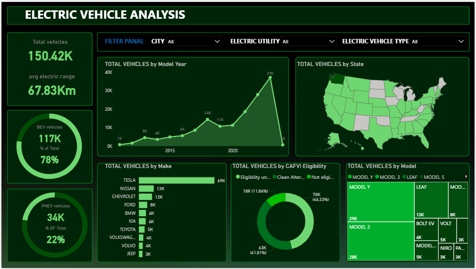

# ⚡ Electric Vehicle (EV) Sales & Adoption Dashboard (Power BI Project)

---

## 📊 Dashboard Preview

---

## 📌 Overview
This project provides an **interactive Power BI dashboard** analyzing **Electric Vehicle (EV) adoption and sales trends**.  
Dataset includes ~XX,XXX EV registrations across multiple states, with details on **vehicle type, range, manufacturer, price, and location**.

---

## 📂 Project Files
- `EV_Dashboard.pbix` → Power BI dashboard  
- `EV_Data.csv` → EV registration dataset  
- `EV_Problem.pptx` → Problem statement (optional)  

---

## 🚀 How to Run
1. Download and open `EV_Dashboard.pbix` in Power BI Desktop  
2. Connect/load `EV_Data.csv` if required  
3. Explore interactive charts & filters  

---

## 🎯 Business Goals
- Analyze EV adoption across **states, counties, and cities**  
- Compare adoption between **BEVs vs PHEVs**  
- Understand **price trends (MSRP) and range distribution**  
- Evaluate **CAFV eligibility** and policy-related insights  
- Identify **top manufacturers and popular EV models**  

---

## 🛠️ Tech Stack
- **Visualization:** Power BI  
- **Dataset:** EV Registration Data (~XX,XXX rows)  
- **Domain:** Electric Vehicles, Sustainability, Clean Energy  

---

## 📊 Key Insights
- ✅ EV adoption shows **year-on-year growth across states**  
- ✅ **BEVs dominate** over PHEVs, but hybrids remain significant  
- ✅ Strong correlation between **electric range & MSRP**  
- ✅ A handful of **top manufacturers drive majority of adoption**  
- ✅ Utility providers vary greatly in EV density, linked with infrastructure availability  

---

✨ *This dashboard highlights how EV adoption is evolving and provides insights into sustainable mobility trends.*
